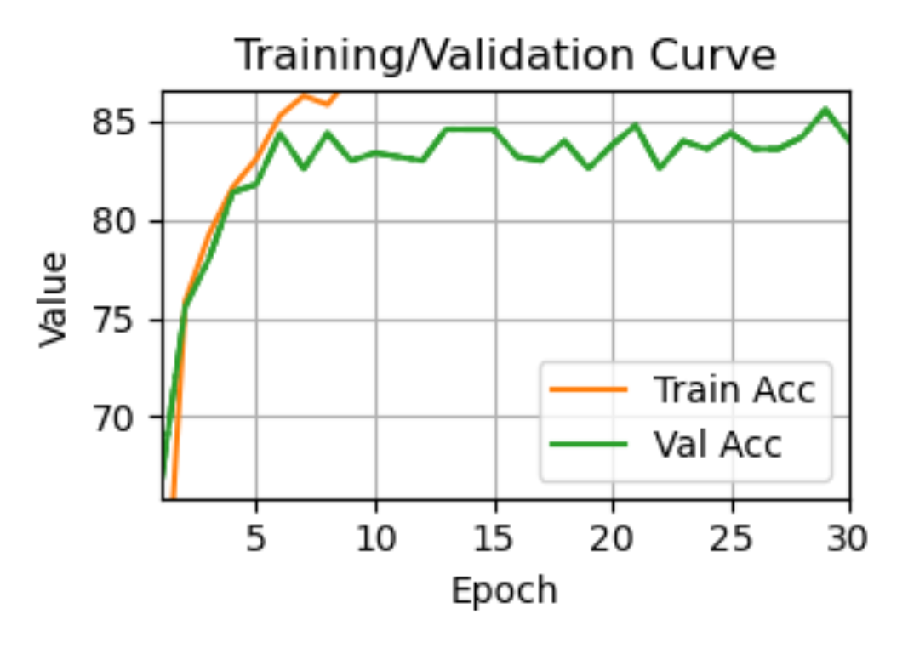

# EfficientNet-B0 on OCTMNIST: Medical Image Classification

This project applies the EfficientNet-B0 model to the **OCTMNIST** dataset, aiming to classify retinal optical coherence tomography images into four diagnostic categories. It explores lightweight CNNs, data augmentation, and regularization techniques to improve performance on small-scale medical image data.

## Method

- **Model**: EfficientNet-B0, pre-trained on ImageNet
- **Input**: Grayscale OCT images, resized to 112×112 and converted to 3-channel RGB using `Grayscale(num_output_channels=3)`
- **Augmentation**: `RandomHorizontalFlip` and `RandomRotation(10°)`
- **Regularization**: Dropout(0.4) added to classification head
- **Optimizer**: Adam (learning rate 1e-4)
- **Loss Function**: CrossEntropyLoss

## Results

| Metric                   | Value                                          |
| ------------------------ | ---------------------------------------------- |
| Best Validation Accuracy | **86.2%**                                      |
| Final Training Accuracy  | ~93.0%                                         |
| Epochs                   | 30                                             |
| Dataset                  | 2000 training samples / 500 validation samples |

>  > _Figure: Accuracy and loss curves over 30 epochs_

## How to Run

```bash
# Environment setup
pip install torch torchvision medmnist matplotlib

# Execute training
python efficientnet_train_clean.py
```

The model will be saved as `efficientnet_best.pth`, and the training curve as `training_curve.png`.

## Next Steps

- Try Mixup or CutMix augmentation
- Add learning rate scheduling (e.g., ReduceLROnPlateau)
- Experiment with EfficientNet-B1/B2 for performance comparison

## Files

| File                          | Description                                 |
| ----------------------------- | ------------------------------------------- |
| `efficientnet_train_clean.py` | Training script with dropout + augmentation |
| `efficientnet_best.pth`       | Best model weights (auto-saved)             |
| `training_curve.png`          | Accuracy/loss training visualization        |
| `README.md`                   | This documentation file                     |

## Author

Liu Siyang  
Statistics major, Minzu University Of China
